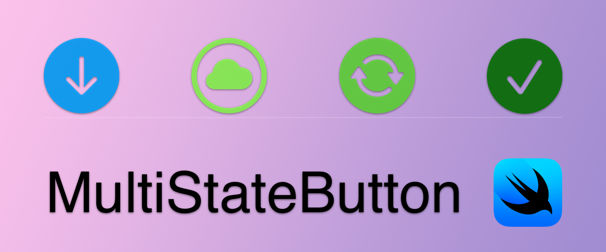
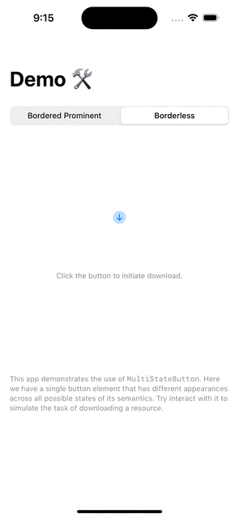

# MultiStateButton

Button elements that encompass multi-state semantics are quite common on iOS.
We can find many examples of such just from some of Apple's first party apps
on iOS, such as buttons that manage download of podcast episodes and albums
in *Podcast* and *Music*, respectively.

Here we present an implementation of such button element tailored for SwiftUI,
with customizability designed in mind.

Here's a demo of a scenario that simulates a download button in action.

## Usage

There are three things needed to implement a multi-state button.

1. Define all possible states of the semantics, as well as a view model for the button.
2. Define an appearance for each possible semantics state.
3. Define the element in your SwiftUI view.

### Define all possible states of the semantics, as well as a view model for the button.

The first step is to define a view model that conforms to the `MultiStateButtonViewModelProtocol` protocol (defined [here](https://github.com/will-ship-it/MultiStateButton/blob/55e440c05e849db6577d21dcde9caaf511c77bb6/Sources/MultiStateButton/MultiStateButtonViewModelProtocol.swift#L10)).

One of the associated types of the protocol is the `State` type, which needs to encompass
all possible states of the semantics of the button.

### Define an appearance for each possible semantics state.

Each state needs to map to a type that conforms to `PrimitiveButtonStyle` (see [here](https://developer.apple.com/documentation/swiftui/primitivebuttonstyle)),
which is defined in SwiftUI that describes a type that applies custom interaction behavior
and a custom appearance to the button.

There are many predefined button styles already defined in SwiftUI. It is your choice to
either use one of the predefined button styles or define your own.

### Define the element in your SwiftUI view.

Once you have all the states mapped, the view model defined and all button styles defined,
the last step is to simply plugging those into `MultiStateButton` (defined [here](https://github.com/will-ship-it/MultiStateButton/blob/55e440c05e849db6577d21dcde9caaf511c77bb6/Sources/MultiStateButton/MultiStateButton.swift#L10C15-L10C31)) and have it defined in your SwiftUI view that consumes the button.

Check out the [demo app](https://github.com/will-ship-it/MultiStateButton/tree/main/Demo/MultiStateButtonDemoApp)
to see an example of how to define and customize such a multi-state button.

## License

This project is licensed under the MIT License.

---

Copyright 2024 Will Li.  
